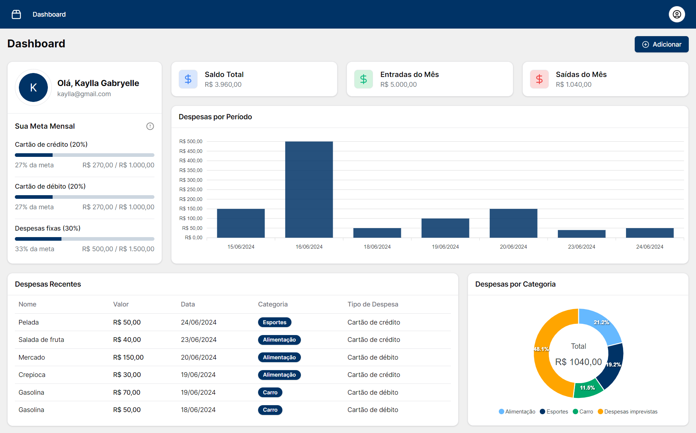

## FULLSTACK FM FINANCE - FINANÇAS PESSOAIS

<p align="center">
  <a href="https://fm-finance.vercel.app" target="_blank">
    Acesse o Deploy
  </a>
</p>

## 💻 Projeto

SISTEMA DE FINANÇAS PESSOAIS

<p align="center">
  
</p>

<br>

## 🧪 Tecnologias

- Server Actions
- Next 14
- Prisma
- Next Auth
- Typescript
- Tanstack/React-Table
- Tanstack/React-Query
- React-Hook-Form
- Zod
- Shadcn-ui
- Tailwind-css

<br>

## 🚀 Como rodar

Para iniciá-lo, siga os passos abaixo:

```bash
# Instalar dependências
$ npm install

# Iniciar o projeto
$ npm run dev
```
